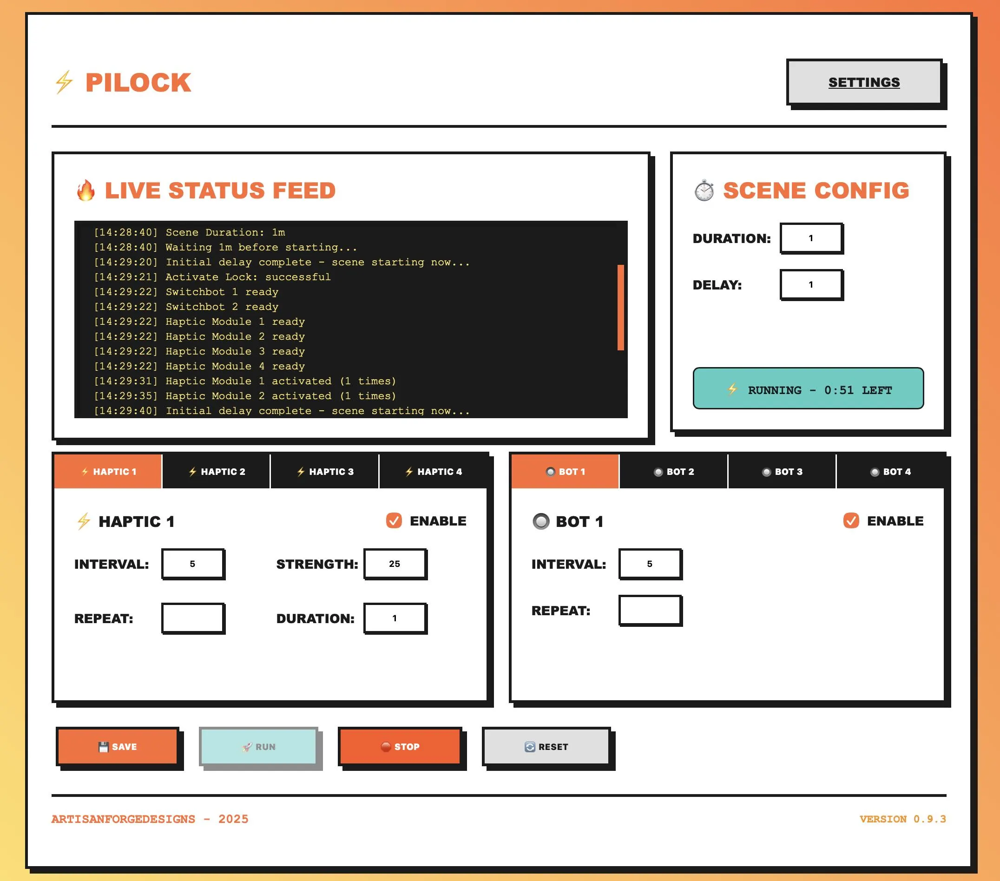

# PiLock User Guide

## Table of Contents

1. [Getting Started](#getting-started)
2. [Settings Configuration](#settings-configuration)
3. [Dashboard & Scene Configuration](#dashboard--scene-configuration)
4. [Advanced Features](#advanced-features)
5. [Basic Usage](#basic-usage)
6. [Frequently Asked Questions](#frequently-asked-questions)

---

## Getting Started

### First Run

1. Plug your device into a standard USB power supply and wait for the PiLock WiFi network to appear (This may take up to 60 seconds)
2. Connect to the PiLock WiFi network and wait for the captive portal page to appear. This may take up to 120 seconds, but you can also navigate directly by typing: `http://192.168.4.1` (or the router address shown in your network info)
3. Select your WiFi network (must be 2.4 GHz), enter your password, click "Connect" and wait a few minutes for the board to reboot and connect
4. Reconnect your device to your home network, wait a minute for PiLock to finish booting, then navigate to: `http://pilock.local:5001`
   - If this doesn't work, check your router's device list to find the IP address, or use a local network scanner tool
5. Done! PiLock will automatically connect to your configured network on future boots. If your network changes or connection fails, the WiFi portal will re-appear at boot

---

## Settings Configuration

Before using PiLock, configure your device settings by clicking **SETTINGS** from the dashboard.

### SwitchBot Account

**What you need:**
- SwitchBot Token
- SwitchBot Secret
- Device IDs for each SwitchBot device you want to control

**How to obtain SwitchBot credentials:**

1. **Download the SwitchBot app** and set up your devices
2. **Get API credentials:**
   - Open the SwitchBot app
   - Navigate to: Profile → Settings → App Version (tap 10 times to unlock developer options)
   - Go back to: Profile → Settings → Developer Options
   - Copy your **Token** and **Secret**

3. **Find Device IDs:**
   - In the SwitchBot app, tap a device
   - Go to Settings (gear icon) → Device Info
   - Copy the BLE MAC address (remove `:` characters)
   - Example format: `F1377ACE514C`

**Configuration:**
- **Token**: Your SwitchBot API token
- **Secret**: Your SwitchBot API secret
- **Device 1-4 IDs**: The device IDs for up to 4 SwitchBot devices

### PiShock Account

**What you need:**
- PiShock username
- PiShock API key
- Share codes for each PiShock device

**How to obtain PiShock credentials:**

1. **Create a PiShock account** at [pishock.com](https://pishock.com)
2. **Get API Key:**
   - Log into your PiShock account
   - Navigate to: Account → API Key
   - Copy your **API Key**
3. **Get Share Codes:**
   - In your PiShock account, select your device
   - Go to: Share Codes tab
   - Create or copy the **Share Code** for each device
   - Each device needs its own share code

**Configuration:**
- **Username**: Your PiShock account username
- **API Key**: Your PiShock API key
- **Sharecode 1-4**: Share codes for up to 4 PiShock devices

### Contact Sensors

Contact sensors trigger **Scene Modifiers** when opened (closed → open transition). You can use either physical SwitchBot Contact Sensors or trigger via API endpoints.

**Option 1: SwitchBot Contact Sensors**
- Find Device IDs the same way as SwitchBot devices (Settings → Device Info)
- Enter the Device ID for each sensor you want to use

**Option 2: HTTP API Endpoints**
- Leave the Device ID field blank
- Use the API endpoint shown in the tooltip to trigger the modifier remotely
- Format: `GET` or `POST` to `http://pilock.local:5001/trigger1` (through `/trigger4`)

**Configuration:**
- **Sensor 1-4 ID**: SwitchBot Contact Sensor Device IDs (optional if using API endpoints)

### Custom Accessories

Custom accessories allow you to integrate any HTTP API-based device or service into your scenes.

**Configuration:**
1. **Endpoint URL**: The full HTTP API endpoint for your custom device
2. **Click PAYLOAD** to configure:
   - **API Method**: GET, POST, PUT, PATCH, or DELETE
   - **JSON Payload**: Request body for POST/PUT/PATCH requests
3. **Test** (Developer Mode): Use the T button to test the endpoint

**Configuration:**
- **Endpoint 1-4**: HTTP API endpoint URLs
- **Method**: HTTP request method (configured via PAYLOAD button)
- **Payload**: JSON request body (configured via PAYLOAD button)

### AFD MagLock Device

**How to obtain eWeLink webhook URLs:**

1. Navigate to: [https://web.ewelink.cc/#/home](https://web.ewelink.cc/#/home)
   - Note: May require eWeLink subscription ($9/month plan)
2. Create a new scene:
   - **IF condition**: Select "Webhook"
   - **THEN action**: Select your MagLock device and choose OFF
3. Repeat step 2 for a second webhook to turn the MagLock ON
4. Test URLs by pasting them into a web browser
   - Webhooks work from any device, anywhere with internet access
   - Confirm your MagLock responds correctly

**Configuration:**
- **Lock**: Webhook URL to engage/lock the device
- **Unlock**: Webhook URL to disengage/unlock the device

### Kill Switch

The Kill Switch provides emergency scene termination via a SwitchBot smart plug.

**How it works:**
- When the configured plug turns OFF, the scene immediately stops
- Optionally calls a consequence API endpoint (e.g., to notify external systems)
- Pair the plug with a physical remote button in the SwitchBot app for emergency stop functionality

**Configuration:**
- **Plug ID**: SwitchBot Plug Device ID (found in Settings → Device Info)
- **Endpoint**: Optional HTTP endpoint called when emergency stop triggers

### Interface Preferences

Customize your PiLock interface behavior.

**Configuration:**
- **Enable Popup Notifications**: Show large visual popups when devices activate during scenes
- **Enable Audio**: Enable text-to-speech audio announcements for device actions and scene events
- **Developer Mode**: Enable advanced features:
  - **DRY RUN** button: Test scenes without triggering real devices
  - **T (Test)** buttons: Test individual devices and components
  - Scene execution with full timing but no actual API calls

---

## Dashboard & Scene Configuration

The dashboard is your main control center for creating and managing scenes.

### Scene Configuration Panel

**Scene Duration:**
- Set how long your scene should run (in minutes)
- Format: `5` (fixed 5 minutes) or `2-10` (random between 2-10 minutes)

**Initial Delay:**
- Delay before the scene starts (in minutes)
- Gives you time to prepare after hitting RUN
- Set to `0` for immediate start

### Device Controls

#### PiShock Modules (Haptic 1-4)

Each PiShock device has these configuration options:

- **ENABLE checkbox**: Enable this device for the current scene
- **Interval**: Time between activations (in seconds)
  - Format: `30` (every 30 seconds) or `15-60` (random between 15-60 seconds)
- **Strength**: Shock intensity level (1-100)
  - Format: `25` (fixed intensity) or `10-50` (random between 10-50)

**Note**: PiShock devices trigger unlimited times during scene duration according to interval settings.

#### SwitchBot Devices (Bot 1-4)

Each SwitchBot device has these configuration options:

- **ENABLE checkbox**: Enable this device for the current scene
- **Interval**: Time between button presses (in seconds)
  - Format: `30` (every 30 seconds) or `15-60` (random between 15-60 seconds)

**Note**: SwitchBot devices trigger unlimited times during scene duration according to interval settings.

#### Custom Accessories (API 1-4)

Each custom accessory has these configuration options:

- **ENABLE checkbox**: Enable this accessory for the current scene
- **Interval**: Time between API calls (in seconds)
  - Format: `30` (every 30 seconds) or `15-60` (random between 15-60 seconds)

**Note**: Custom accessories trigger unlimited times during scene duration according to interval settings. Configure endpoint and payload in Settings.

### Live Status Feed

The status feed shows real-time updates:
- Scene start/stop events
- Device activations with details
- Countdown timers
- Error messages
- Modifier triggers
- Auto-scrolls to latest messages (pauses when you scroll up)

---

## Advanced Features

### Scene Modifiers

Scene Modifiers allow dynamic changes to running scenes based on contact sensor triggers (or API endpoints). Each modifier can only execute once per scene, even if triggered multiple times.

#### Modifier 1: Extend Scene Time

Dynamically extends the running scene by additional minutes.

**Configuration:**
- **ENABLE checkbox**: Enable this modifier
- **Trigger**: Which contact sensor (1-4) activates this modifier
- **Extend**: Additional minutes to add to scene
  - Format: `5` (fixed 5 minutes) or `5-25` (random between 5-25 minutes)

**Behavior:**
- When contact sensor opens, scene duration increases by specified minutes
- Timer updates immediately to show new end time
- Can only trigger once per scene

#### Modifier 2: Haptic Trigger

Enables and activates a PiShock device mid-scene.

**Configuration:**
- **ENABLE checkbox**: Enable this modifier
- **Trigger**: Which contact sensor (1-4) activates this modifier
- **Haptic**: Which PiShock device (1-4) to enable

**Behavior:**
- When contact sensor opens, selected PiShock device initializes and enables
- Device begins triggering at configured interval immediately
- Dashboard indicator updates from ○ to ● automatically
- Device settings restored to pre-scene state after scene ends

#### Modifier 3: Bot Trigger

Enables and activates a SwitchBot device mid-scene.

**Configuration:**
- **ENABLE checkbox**: Enable this modifier
- **Trigger**: Which contact sensor (1-4) activates this modifier
- **Bot**: Which SwitchBot device (1-4) to enable

**Behavior:**
- When contact sensor opens, selected SwitchBot device initializes and enables
- Device begins triggering at configured interval immediately
- Dashboard indicator updates from ○ to ● automatically
- Device settings restored to pre-scene state after scene ends

#### Modifier 4: Custom Trigger

Enables and activates a Custom Accessory mid-scene.

**Configuration:**
- **ENABLE checkbox**: Enable this modifier
- **Trigger**: Which contact sensor (1-4) activates this modifier
- **Accessory**: Which custom accessory (1-4) to enable

**Behavior:**
- When contact sensor opens, selected custom accessory enables
- Accessory begins triggering at configured interval immediately
- Dashboard indicator updates from ○ to ● automatically
- Device settings restored to pre-scene state after scene ends

### Device State Preservation

PiLock automatically preserves and restores device states:

**How it works:**
1. Before scene starts, PiLock saves current enabled/disabled state of all devices
2. Scene Modifiers can enable devices mid-scene dynamically
3. After scene ends (stopped or completed), original states are automatically restored
4. Next scene starts with clean configuration (modifier changes don't persist)

**Benefits:**
- Modifiers don't affect future scenes
- Predictable scene behavior
- No manual cleanup required

### Popup Notifications

Large, highly-visible notifications for device actions (when enabled in Interface Preferences).

**Features:**
- Color-coded by device type:
  - Orange/red for PiShock devices
  - Teal for SwitchBot devices
  - Yellow for MagLock
- Large text visible from several feet away
- 3-second display duration
- Animated with bounce-style transitions
- Queue-based (won't overlap)

### Audio Notifications

Text-to-speech announcements for scene events and device actions (when enabled in Interface Preferences).

**Features:**
- Verbal announcements for all device activations
- Scene start announcement: "Scene starting - Duration X minutes"
- Scene completion announcement: "Scene complete"
- Emergency stop announcements
- Clear speech settings optimized for comprehension
- Queue-based to prevent overlap

### Developer Mode Features

Enable Developer Mode in Interface Preferences to access advanced testing features:

#### Dry Run Mode

Test scenes without triggering real devices.

**How to use:**
1. Configure your scene normally on the dashboard
2. Click **DRY RUN** instead of RUN
3. Scene executes with full timing, status messages, and notifications
4. No actual API calls to devices are made

**Benefits:**
- Test scene timing and logic safely
- Verify configuration without device activations
- Debug issues without physical consequences

#### Test Buttons

Small **T** buttons appear next to configured devices when Developer Mode is enabled.

**Available tests:**
- Contact Sensors: Test trigger endpoints
- Custom Accessories: Test API endpoints
- MagLock: Test lock/unlock webhooks
- Kill Switch: Test plug monitoring and consequence endpoint

**Visual feedback:**
- Green: Test successful
- Red: Test failed
- Results logged to status feed

---

## Basic Usage

### Creating Your First Scene

1. **Configure Settings** (one-time setup):
   - Click **SETTINGS**
   - Enter your SwitchBot and/or PiShock credentials
   - Configure any custom accessories or contact sensors
   - Click **SAVE SETTINGS**

2. **Set Up a Scene**:
   - On the dashboard, set **Scene Duration** (e.g., `5` for 5 minutes)
   - Set **Initial Delay** if desired (e.g., `1` for 1-minute delay)
   - Enable devices you want to use (check ENABLE boxes)
   - Configure intervals and intensities for enabled devices
   - Optionally configure Scene Modifiers
   - Click **SAVE**

3. **Run the Scene**:
   - Click **RUN**
   - Watch the header timer and status display show countdown
   - Devices activate according to your configuration
   - Click **STOP** to stop early if needed

### Understanding Status Display

The compact status display in the Scene Config panel shows:

- **Idle**: No scene is currently running
- **Waiting - X:XX LEFT**: Scene is in initial delay phase (countdown shows delay time remaining)
- **Running - X:XX LEFT**: Scene is active (countdown shows scene time remaining)

The header timer (replaces AFD logo when scene is running):
- Large countdown display visible from across the room
- Shows total remaining time (delay + scene duration)
- Returns to AFD logo when scene ends

### Scene Control Buttons

- **SAVE**: Save your current scene configuration (no page reload)
- **RUN**: Begin a new scene (disabled if scene is already running)
- **DRY RUN**: Test scene without real devices (Developer Mode only)
- **STOP**: Stop the current scene immediately
- **DEFAULT**: Reset all settings to default values

### Using Scene Modifiers

**Example workflow:**

1. **Configure a modifier on the dashboard:**
   - Enable "Modifier 2: Haptic Trigger"
   - Set Trigger to "1" (Contact Sensor 1)
   - Set Haptic to "2" (PiShock device 2)
   - Save configuration

2. **Configure the trigger in Settings:**
   - Enter SwitchBot Contact Sensor Device ID in "Sensor 1 ID"
   - OR leave blank and use API endpoint: `http://pilock.local:5001/trigger1`

3. **Run a scene:**
   - Start scene with PiShock 2 initially disabled
   - When contact sensor opens (or API endpoint called), PiShock 2 activates mid-scene
   - Dashboard automatically updates to show device enabled (○ → ●)
   - PiShock 2 begins triggering at configured intervals
   - After scene ends, PiShock 2 returns to disabled state

---

## Frequently Asked Questions

### General Usage

**Q: The scene won't start - what's wrong?**

A: Check that:
- At least one device is enabled (checkbox checked)
- Your API credentials are correct in Settings
- Device IDs/share codes are valid
- You clicked **SAVE** after making changes

**Q: Can I run multiple scenes at once?**

A: No, only one scene can run at a time. Stop the current scene before starting a new one.

**Q: What happens if I lose internet connection during a scene?**

A: The scene will continue running, but device commands may fail. Check the status feed for error messages.

**Q: Do Scene Modifier changes persist to the next scene?**

A: No. PiLock automatically saves and restores device states before/after each scene. Modifier changes only affect the current running scene.

### Device Configuration

**Q: My PiShock device isn't responding**

A: Verify:
- Share code is correct (not the device ID)
- API key is valid
- Username matches your PiShock account exactly
- Device is online and charged
- You can control it from PiShock.com

**Q: SwitchBot commands aren't working**

A: Check:
- Token and secret are correct (tap App Version 10 times to unlock Developer Options)
- Device ID is the BLE MAC without colons
- Device is within Bluetooth/Hub range
- SwitchBot app can control the device
- Hub is online (if using cloud control)

**Q: My smart lock isn't responding to webhook calls**

A: Ensure:
- Webhook URLs start with `https://us-apia.coolkit.cc/v2/`
- Webhooks are properly configured in eWeLink web interface
- Lock device is online and responsive in eWeLink app
- You tested the URLs manually in a web browser

**Q: Contact Sensor isn't triggering my modifier**

A: Verify:
- Sensor Device ID is correct in Settings
- Sensor is paired and online in SwitchBot app
- Sensor shows "Closed" status before opening
- Modifier is enabled on dashboard
- Trigger number matches sensor number (1-4)
- Scene is running when you open the sensor

**Q: Custom Accessory isn't working**

A: Check:
- Endpoint URL is correct and accessible
- Payload JSON is valid (test in PAYLOAD editor)
- API method is correct (GET, POST, etc.)
- Endpoint accepts requests from PiLock's IP
- Test button (Developer Mode) shows success

### Scene Behavior

**Q: Why do my devices trigger at different times than expected?**

A: PiLock uses interval as "time between triggers", not "triggers per minute". A 30-second interval means the device activates every 30 seconds throughout the scene.

**Q: What does "random" mean for intervals and intensity?**

A: Random values are calculated for each trigger. For example, `10-30` intensity will choose a random number between 10 and 30 for each activation.

**Q: Can I have unlimited device triggers?**

A: Yes. All devices trigger unlimited times during the scene duration according to their interval settings.

**Q: The countdown shows wrong time**

A: During the delay phase, countdown shows time remaining in delay. During scene execution, it shows scene time remaining. The header timer always shows total time left.

**Q: Can a Scene Modifier trigger multiple times?**

A: No. Each modifier can only execute once per scene, even if the trigger fires multiple times. This prevents accidental duplicate actions.

**Q: Why did my device indicators change from ○ to ● during a scene?**

A: A Scene Modifier was triggered and enabled that device mid-scene. The indicators update in real-time to show current device states.

### Notifications

**Q: Popup notifications are too small/large**

A: Popup size is optimized for visibility from several feet away (500px x 300px minimum). Size automatically adjusts on mobile devices.

**Q: Audio notifications aren't playing**

A: Check:
- "Enable Audio" is checked in Interface Preferences
- Browser allows audio (you may need to interact with page first)
- Device volume is turned up
- Status feed shows notification events

**Q: How do I disable notifications?**

A: Uncheck "Enable Popup Notifications" and/or "Enable Audio" in Settings → Interface Preferences.

### Kill Switch

**Q: Kill switch isn't stopping the scene**

A: Verify:
- SwitchBot Plug Device ID is correct
- Plug is online in SwitchBot app
- Plug turns OFF (not just unplugged)
- Scene is running when plug turns off
- Status feed shows killswitch monitoring messages

**Q: Consequence endpoint isn't being called**

A: Check:
- Endpoint URL is correct
- Endpoint is accessible from PiLock
- Killswitch successfully stopped the scene
- Status feed shows "calling consequence endpoint" message

### Developer Mode

**Q: How do I test my scene without triggering devices?**

A: Enable Developer Mode in Interface Preferences, then use the **DRY RUN** button instead of **RUN**. Scene will execute with full timing and notifications but no real API calls.

**Q: Test buttons aren't showing**

A: Enable Developer Mode in Settings → Interface Preferences. Test buttons (T) will appear next to configured devices.

**Q: What does a red test button mean?**

A: Test failed. Check the status feed for error details and verify your configuration (API credentials, device IDs, endpoint URLs, etc.).

### Updates

**Q: How do I check for updates?**

A: On the Settings page, click **CHECK FOR UPDATES**. If an update is available, you'll see **UPDATE** and **CANCEL** buttons.

**Q: Will updating overwrite my settings?**

A: No. Updates only change the application code. Your settings and scene configurations in the `data/` folder are preserved.

**Q: What version am I running?**

A: Check the footer at the bottom of any page for the current version number.

---

## Need More Help?

Contact: [artisanforgedesigns@gmail.com](mailto:artisanforgedesigns@gmail.com)
